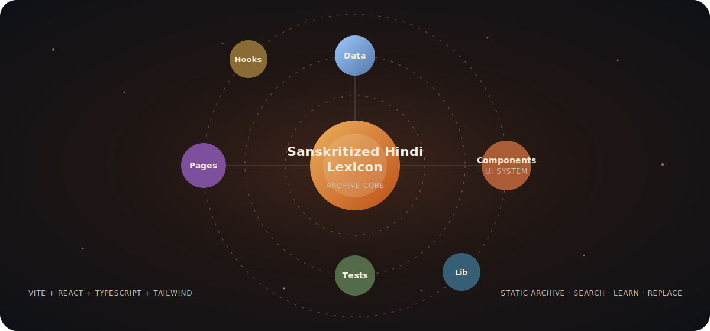
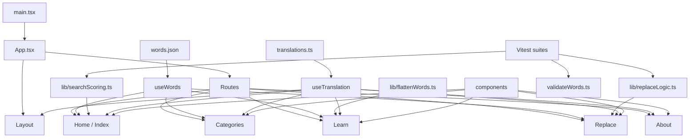

# 📚 Sanskritized Hindi Lexicon


**Version 2.0 · June 2026**

Sanskritized Hindi Lexicon is a structured, etymology-based web archive for exploring Sanskrit-derived Hindi vocabulary alongside words from other historical sources such as Persian, Arabic, Turkic, and English.

This project is a linguistic reference and educational archive. It is **not** a correction tool, political tool, or purity tool.

---

## Table of Contents

- [Overview](#overview)
- [Architecture Animation](#architecture-animation)
- [Core Features](#core-features)
- [Pages](#pages)
- [Tech Stack](#tech-stack)
- [Project Structure](#project-structure)
- [Data Model](#data-model)
- [Search System](#search-system)
- [Accessibility and Preferences](#accessibility-and-preferences)
- [Getting Started](#getting-started)
- [Available Scripts](#available-scripts)
- [Testing and Validation](#testing-and-validation)
- [Design Language](#design-language)
- [Deployment](#deployment)
- [Project Philosophy](#project-philosophy)

---

## Overview

The application presents Hindi vocabulary as an archive of concepts. Each concept can contain:

- Sanskrit-derived Hindi forms
- Other historical-source forms
- Devanagari spelling
- Roman transliteration
- IPA pronunciation
- Register tags such as formal, colloquial, literary, classical, legal, technical, and more
- Category metadata
- Antonyms where available
- Hindi-mode descriptions

The product goal is simple: make linguistic comparison readable, searchable, and pleasant without flattening the history of the words.

---

## Architecture Animation

The app is designed like a small solar system: a static archive core, with data, UI, hooks, pages, tests, and utilities orbiting around it.





---

## Core Features

### Lexicon Archive

- 1,400+ curated concepts
- Sanskrit-derived and other historical-source entries
- Devanagari, romanization, and IPA for each word entry
- Category browsing with emoji-based category markers
- Word of the Day
- Entry detail drawer for uninterrupted browsing
- Sticky A-Z navigation and mini glossary indicators

### Search

- English, Devanagari, romanized Hindi, and IPA search
- Weighted scoring for exact, prefix, word-boundary, substring, and fuzzy matches
- Script-aware result boosting
- Debounced input for responsive filtering
- Empty-state suggestions for Devanagari, romanized, IPA, and category browsing

### Learn Mode

- Flashcard-style learning interface
- Sequential, shuffle, and random navigation
- Category filtering
- Bookmarking
- Keyboard navigation
- Audio pronunciation with Web Speech API
- Progress indicator in the navbar

### Replace Tool

- Accepts Hindi text input
- Detects known historical-source words
- Replaces them with Sanskrit-derived equivalents
- Highlights replacements
- Provides replacement detail chips
- Opens full lexical detail in the shared entry drawer

### UI and Archive Experience

- Manuscript-inspired visual language
- Devanagari background motifs
- Animated multilingual home heading
- Sticky search rail
- Responsive mobile-first layouts
- Drawer-based details for browsing continuity

---

## Pages

| Route | Page | Purpose |
| --- | --- | --- |
| `/` | Home | Main searchable lexicon with Word of the Day, sticky search, A-Z rail, and infinite scroll |
| `/categories` | Categories | Browse entries by curated themes and alphabetical sections |
| `/learn` | Learn | Flashcards, bookmarks, audio, category filtering, and keyboard learning |
| `/replace` | Replace | Transform Hindi text using Sanskrit-derived equivalents |
| `/about` | About | Project philosophy, linguistic context, source availability, and version information |
| `*` | Not Found | Fallback route |

---

## Tech Stack

| Layer | Technology |
| --- | --- |
| Frontend | React 18 |
| Language | TypeScript 5 |
| Build Tool | Vite 5 |
| Styling | Tailwind CSS 3 |
| Routing | React Router 6 |
| UI Primitives | Radix Dialog, Popover, Tooltip |
| Icons | Lucide React |
| Notifications | Sonner |
| Testing | Vitest, Testing Library, jsdom |
| Persistence | LocalStorage |
| Audio | Browser Web Speech API |

---

## Project Structure

```text
sanskritized-hindi-lexicon/
├── README.md
├── package.json
├── package-lock.json
├── index.html
├── vite.config.ts
├── vitest.config.ts
├── tailwind.config.ts
├── postcss.config.js
├── eslint.config.js
├── tsconfig.json
├── tsconfig.app.json
├── tsconfig.node.json
├── components.json
├── vercel.json
├── docs/
│   └── architecture-orbit.svg
├── public/
│   ├── archive-seal.svg
│   ├── favicon.svg
│   ├── og-image.png
│   └── robots.txt
└── src/
    ├── main.tsx
    ├── App.tsx
    ├── index.css
    ├── vite-env.d.ts
    ├── components/
    ├── components/ui/
    ├── data/
    ├── hooks/
    ├── lib/
    ├── pages/
    ├── test/
    └── types/
```

### `src/components`

Reusable interface modules.

| File | Responsibility |
| --- | --- |
| `Layout.tsx` | Global shell, navigation, settings controls, footer, scroll-to-top |
| `WordCard.tsx` | Main archive entry card |
| `EntryDetailDrawer.tsx` | Side drawer for full entry details |
| `SearchBar.tsx` | Debounced search input |
| `WordOfTheDay.tsx` | Deterministic daily featured word |
| `LearnCard.tsx` | Flashcard display for Learn mode |
| `CategoryGrid.tsx` | Category filter chips |
| `AnimatedHeading.tsx` | Home page multilingual heading |
| `HomeScriptBackdrop.tsx` | Floating Devanagari background on Home |
| `DevanagariBackdrop.tsx` | Manuscript page background texture |
| `ManuscriptOrnaments.tsx` | Shared dividers and page header ornaments |
| `InlineAudio.tsx` | Per-word pronunciation button |
| `SoundWave.tsx` | Audio animation |
| `DataFallback.tsx` | Missing-data fallback |
| `WordsLoading.tsx` | Loading state |
| `ErrorBoundary.tsx` | Runtime error boundary |

### `src/components/ui`

Small Radix-based primitives:

- `popover.tsx`
- `sheet.tsx`
- `skeleton.tsx`
- `sonner.tsx`
- `tooltip.tsx`

### `src/pages`

Route-level views:

- `Index.tsx`
- `Categories.tsx`
- `Learn.tsx`
- `Replace.tsx`
- `About.tsx`
- `NotFound.tsx`

### `src/data`

| File | Purpose |
| --- | --- |
| `words.json` | Primary lexicon dataset |
| `descriptions_hi.ts` | Hindi-mode descriptions keyed by concept |

### `src/hooks`

| File | Purpose |
| --- | --- |
| `useWords.tsx` | Loads and exposes the word dataset |
| `useTranslation.ts` | Translation lookup and Hindi-mode helpers |
| `useAccessibility.tsx` | Text size, high contrast, dark mode, Hindi mode, learn category |
| `useBookmarks.tsx` | Learn-mode bookmarks |
| `useLearnProgress.tsx` | Navbar progress indicator for Learn mode |

### `src/lib`

| File | Purpose |
| --- | --- |
| `constants.ts` | Categories, tags, category metadata |
| `searchScoring.ts` | Search normalization, scoring, fuzzy matching |
| `replaceLogic.ts` | Sentence replacement engine |
| `flattenWords.ts` | Converts concepts into learnable word entries |
| `getWordOfTheDay.ts` | Deterministic daily concept selection |
| `normalize.ts` | Romanization and IPA normalization helpers |
| `numerals.ts` | English/Hindi number formatting |
| `punctuationSymbols.ts` | Symbol lookup for punctuation-related entries |
| `translations.ts` | Hindi UI translation map |
| `validateWords.ts` | Dataset validation rules |
| `utils.ts` | Shared utility helpers |

### `src/test`

Test setup for Vitest and Testing Library.

### `src/types`

Shared TypeScript schema definitions, including `Concept`, `WordEntry`, and controlled `Tag` types.

---

## Data Model

Primary concept shape:

```ts
export interface Concept {
  english: string;
  category: string;
  description: string;
  sanskrit_derived: WordEntry[];
  other_historical_sources: WordEntry[];
  antonyms?: string[];
}
```

Word entry shape:

```ts
export interface WordEntry {
  dev: string;
  roman: string;
  ipa: string;
  tags: Tag[];
}
```

Controlled tags:

```ts
type Tag =
  | "formal"
  | "colloquial"
  | "classical"
  | "archaic"
  | "literary"
  | "religious"
  | "philosophical"
  | "administrative"
  | "legal"
  | "academic"
  | "technical";
```

Rules:

- Every concept must have a category.
- Each concept should include at least one word entry.
- Each word entry uses a controlled set of tags.
- A word entry should not exceed two tags.
- Antonyms are optional and concept-level.

---

## Search System

Search lives primarily in `src/lib/searchScoring.ts` and the Home route.

The search pipeline:

1. Detect the query script: Devanagari, IPA, or roman text.
2. Normalize roman text for diacritic-insensitive matching.
3. Score exact matches highest.
4. Score prefix and word-boundary matches next.
5. Score substring matches with position and length penalties.
6. Apply fuzzy matching for romanized text.
7. Boost fields that match the query script.
8. Sort by score, then alphabetically.

This makes searches like English words, Devanagari spellings, romanized Hindi, and IPA all usable in the same input.

---

## Accessibility and Preferences

User-facing preferences are persisted with LocalStorage:

- Hindi UI mode
- Dark mode
- High contrast mode
- Text scaling
- Learn category
- Learn bookmarks
- Learn progress index
- Replace tool input

Accessibility-focused details:

- Keyboard navigation in Learn mode
- Focus styles on controls
- Semantic buttons and links
- Accessible labels for audio and settings
- Reduced-motion support for animated UI
- Readable text contrast and controlled font sizes

---

## Getting Started

### Requirements

- Node.js 18+
- npm 9+

### Installation

```bash
npm install
```

### Development

```bash
npm run dev
```

Vite will start a local development server, usually at:

```text
http://localhost:5173
```

### Production Build

```bash
npm run build
```

### Preview Production Build

```bash
npm run preview
```

---

## Available Scripts

| Script | Description |
| --- | --- |
| `npm run dev` | Start Vite dev server |
| `npm run build` | Build production assets |
| `npm run build:dev` | Build in development mode |
| `npm run preview` | Preview production build locally |
| `npm run lint` | Run ESLint |
| `npm run test` | Run Vitest once |
| `npm run test:watch` | Run Vitest in watch mode |

---

## Testing and Validation

Test files currently cover:

- Search scoring
- Replacement logic
- Dataset validation

Useful commands:

```bash
npm run lint
npm run test
npm run build
```

Dataset validation rules are implemented in:

```text
src/lib/validateWords.ts
```

---

## Design Language

The interface uses a manuscript-inspired archive aesthetic:

- Warm parchment backgrounds
- Saffron and copper accents
- Devanagari ornamentation
- Minimal cards and readable text surfaces
- Controlled line work and borders
- Emoji category markers for quick scanning
- Floating background letters on the Home page
- A manuscript-style About page

The design priority is always readability first, atmosphere second.

---

## Deployment

The app is a static Vite build and can be deployed anywhere that serves static assets.

Included deployment metadata:

```text
vercel.json
```

Typical production flow:

```bash
npm install
npm run build
```

Deploy the generated:

```text
dist/
```

---

## Version

Current release:

```text
2.0.0
```

Visible product label:

```text
Version 2.0 · June 2026
```

---

## Project Philosophy

This archive documents word histories and registers without ranking them.

Hindi is layered, historical, and alive. Sanskrit-derived vocabulary, Persianate vocabulary, Arabic-derived vocabulary, Turkic traces, English loans, and regional usage all carry cultural and linguistic meaning. This project exists to make those layers easier to study.

> This is a linguistic archive. Not a correction tool. Not a political tool. Not a purity tool.

